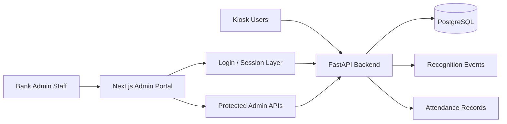

# Banking Staff Attendance System Admin Portal

Next.js administrative frontend for a final-year thesis project on AI/computer vision-based bank staff attendance management.

## Abstract

This repository provides the administrative portal for the banking staff attendance thesis system. Its role is not to perform face recognition itself, but to transform backend outputs into operationally useful views for administrators. The portal consumes protected FastAPI APIs and presents dashboard KPIs, attendance records, recognition-event monitoring, enrollment quality indicators, reports, and system status. It is designed to support thesis defense by making the AI pipeline observable while also presenting a realistic monitoring interface for bank administrative staff.

## Problem Statement

An AI-based attendance system is incomplete without an interface for reviewing its results, monitoring exceptions, and verifying that enrolled staff data is sufficiently prepared for reliable operation. In a banking context, administrators need more than a raw list of recognitions. They need to understand:

- how many employees are present or late
- whether the recognition model is operationally ready
- which scans failed or require review
- which employees still have incomplete enrollment data
- how attendance records relate to underlying recognition outcomes

This admin portal addresses that problem by providing a clean, role-protected interface over the FastAPI backend.

## Objectives

The objectives of this frontend repository are:

- provide a secure admin interface for the attendance platform
- present decision-oriented operational KPIs
- expose AI-related quality signals for thesis evaluation
- support attendance review using backend-provided business records
- show enrollment quality and dataset completeness per employee
- separate public kiosk usage from administrative monitoring

## Scope of This Repository

This repository is responsible for:

- admin login flow
- route protection through HTTP-only cookie session handling
- server-rendered dashboard pages using backend APIs
- attendance table views and filters
- employee enrollment monitoring views
- recognition-event monitoring
- reporting and system health pages

This repository does not perform:

- face detection
- face recognition inference
- liveness checking
- direct attendance business-rule computation

Those responsibilities remain in the FastAPI backend repository.

## System Role in the Thesis

The thesis-level contribution is not only the computer vision model, but the full decision pipeline around it. This admin portal helps demonstrate:

- how AI recognition outcomes are surfaced for human review
- how business attendance records differ from raw recognition events
- how enrollment quality affects operational readiness
- how protected administrative access can be added without introducing an enterprise IAM stack

## Frontend Architecture

The portal uses:

- Next.js App Router
- React server components for most data views
- route handlers for secure login/logout proxying
- HTTP-only cookie storage for admin session tokens
- a small typed API layer for backend integration

### Main Areas

- `dashboard`
  - operational KPIs
  - attendance trend charts
  - recognition success vs failure view
  - enrollment warnings
- `attendance`
  - date filters
  - status and record-state filters
  - recognition outcome details for check-in/check-out
- `persons`
  - employee registration
  - dataset completeness
  - missing enrollment warnings
- `recognition-events`
  - raw AI evidence review
- `reports`
  - aggregated summary views
- `system`
  - system-only health and configuration baseline monitoring

## Admin Security Model

The current frontend uses a thesis-sized, practical auth structure:

1. credentials are submitted to the FastAPI backend
2. the backend returns a signed access token
3. Next.js stores the token in an HTTP-only cookie
4. server-side data fetching includes the bearer token automatically
5. middleware redirects unauthenticated users to `/login`

Supported roles:

- `super_admin`
- `hr_admin`

### Role-Permission Matrix

| Area | super_admin | hr_admin |
|---|---|---|
| Login to admin portal | Yes | Yes |
| Dashboard | Yes | Yes |
| Attendance records | Yes | Yes |
| Persons / enrollment overview | Yes | Yes |
| Recognition event monitoring | Yes | Yes |
| Reports | Yes | Yes |
| System page | Yes | No |

## System Architecture



## Recognition Events vs Attendance Records in the UI

One of the most important design ideas reflected in the portal is that raw AI output is not treated as final attendance.

### Recognition Events in the Portal

Recognition-event views help administrators inspect:

- matched recognitions
- unregistered recognitions
- duplicate-ignored events
- outside-shift events
- low-liveness failures

These pages support thesis defense by showing how the AI system behaves operationally.

### Attendance Records in the Portal

Attendance pages focus on business records such as:

- present
- late
- checked out
- review required

These views support HR-style oversight rather than raw inference inspection.

## Dashboard Design Philosophy

The dashboard has been intentionally shaped around practical administrative monitoring instead of visual novelty. Current dashboard priorities are:

- who is present today
- who is late today
- whether failed recognitions are increasing
- whether the recognition model is ready
- whether enrollment data is incomplete

This makes the interface easier to explain during thesis defense and more realistic for bank operations staff.

## Data Fetching Approach

The portal follows the current codebase architecture and avoids unnecessary client complexity:

- most pages fetch backend data on the server
- protected requests use the token stored in cookies
- client-side logic is kept mainly for forms and logout
- loading and error states are explicit but lightweight

This approach is appropriate because the portal is an operational admin interface rather than a highly interactive consumer web app.

## Thesis-Friendly Features Reflected in the UI

Implemented and visible in this portal:

- present today KPI
- late today KPI
- failed recognition KPI
- total enrolled staff KPI
- model readiness KPI
- daily attendance trend
- weekly late trend
- recognition success vs failure comparison
- dataset completeness per employee
- missing enrollment warnings
- attendance status badges
- attendance filters
- recognition outcome detail columns
- protected admin access

## Limitations

The current frontend is deliberately scoped for thesis feasibility. Important limitations include:

- no full-featured user management UI yet
- no approval workflow UI for attendance adjustments
- no client-side charting library; trends are shown through lightweight visual bars
- no live websocket-based updates; data is refreshed per page request
- no fine-grained branch-specific dashboard segmentation yet

## Future Work

Natural extensions for this portal include:

- richer reports and export workflows
- attendance adjustment approval screens
- branch-specific administration views
- monthly or payroll-oriented summary modules
- stronger audit-log visualization
- improved session lifecycle with refresh tokens and stricter production cookie settings

## Backend Relationship

This portal expects the companion backend repository:

- `attendance-face-detection`

The backend provides:

- face recognition inference
- liveness verification
- database persistence
- role-protected admin APIs
- public kiosk flow

## Setup and Installation

### Prerequisites

- Node.js
- backend repository running and reachable

### Install

```bash
npm install
```

### Environment

Create `.env.local` if needed:

```env
NEXT_PUBLIC_API_BASE_URL=http://127.0.0.1:8168
```

## Running the Admin Portal

### Development

```bash
npm run dev
```

### Production Build

```bash
npm run build
npm run start
```

Default URL:

- `http://localhost:3000`

## API Dependencies

The frontend currently depends on these backend capabilities:

### Authentication

- `/api/auth/login`
- `/api/auth/me`
- `/api/auth/logout`

### Dashboard and Monitoring

- `/api/admin/dashboard/summary`
- `/api/admin/reports/summary`
- `/api/admin/system/health`

### Attendance and People

- `/api/admin/attendance/records`
- `/api/admin/attendance/dates`
- `/api/admin/persons`
- `/api/admin/persons/list`
- `/api/admin/persons/stats`
- `/api/admin/master-data/branches`
- `/api/admin/master-data/shifts`

### AI Review

- `/api/admin/recognition-events`
- `/api/admin/recognition-events/stats`

## Project Structure

- `app/(admin)/dashboard` dashboard view
- `app/(admin)/attendance` attendance records view
- `app/(admin)/persons` employee and enrollment view
- `app/(admin)/recognition-events` AI evidence review view
- `app/(admin)/reports` reporting view
- `app/(admin)/system` system monitoring view
- `app/login` login page
- `app/api/session/*` local session route handlers
- `components/admin/` reusable admin UI components
- `lib/api.ts` typed backend fetch layer
- `lib/auth.ts` session helpers
- `lib/types.ts` shared payload types
- `middleware.ts` route protection

## Why This Frontend Design Fits the Thesis

This design is appropriate for the thesis because it is:

- accurate to the implemented backend
- simple enough to maintain as a student project
- strong enough to demonstrate operational credibility
- explicit about AI quality signals rather than hiding them behind only attendance totals
- secure enough for academic defense through protected admin access and role boundaries

## Production Upgrades Later

If extended beyond thesis scope, the portal could be improved with:

- richer session handling and refresh-token support
- stronger audit-log and approval interfaces
- chart libraries for denser analytics
- branch-scoped access control in the UI
- integration with enterprise identity systems

## Troubleshooting

- Login fails:
  - verify the backend is running
  - verify seeded admin credentials
  - verify backend `APP_SECRET_KEY`
- API request fails:
  - verify `NEXT_PUBLIC_API_BASE_URL`
  - verify backend route protection is receiving the session token
- No dashboard data:
  - verify backend database has seeded data
  - verify the backend model and attendance services are running
